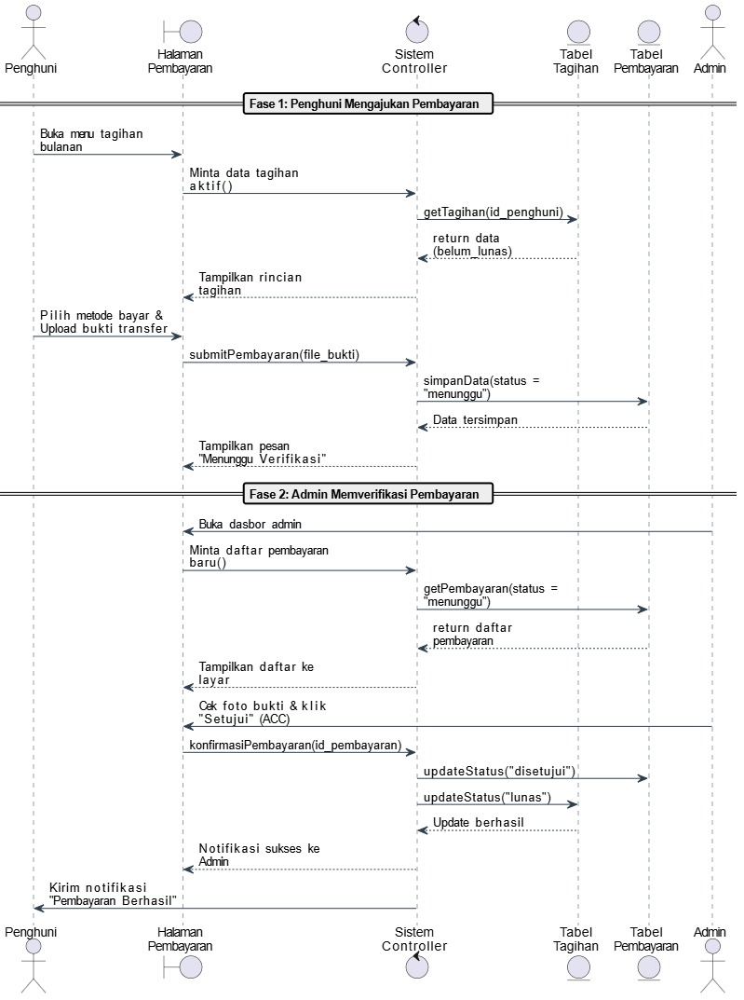
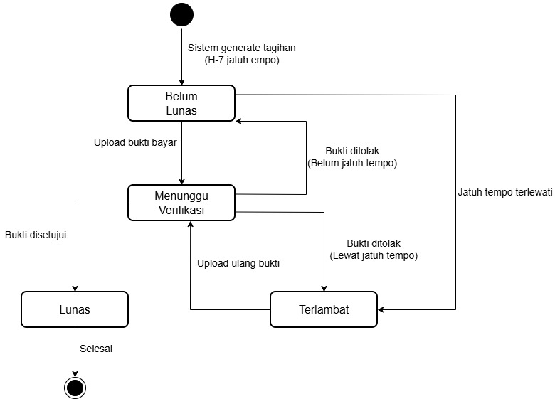

# Laporan Analisis Perancangan Berorientasi Objek - Kelompok 1

## Anggota Kelompok
| **Nama** | **NPM** |
| :--- | :--- |
| Chandra Cornelius L Tobing | 4524210022 |
| Andika Prasetyo | 4524210013 |
| Damar Syeka | 4524210023 |

 

# Informasi dan Ruang Lingkup Proyek

## Topik dan Judul Proyek
* **Topik:** Bisnis – Manajemen Kost
* **Judul Project:** **Sistem Manajemen Kost** Aplikasi Pengelolaan Kost Berbasis Web dengan Fitur Notifikasi dan Pelacakan Pembayaran

## Sasaran Pengguna (Aktor)
Sistem Manajemen Kost ini dirancang untuk mempermudah komunikasi dan proses administrasi antara pihak pengelola dan penyewa kamar. Di dalam sistem ini, terdapat tiga peran utama yang terlibat:

* **Penjaga atau Admin Kost:** Merupakan pihak yang bertugas mengurus operasional sehari-hari di lokasi kost. Admin memiliki akses untuk melakukan pendataan ketika ada penghuni baru yang masuk, memantau kamar mana saja yang sedang kosong atau terisi, melakukan verifikasi terhadap status pembayaran bulanan, serta mengelola hal-hal terkait fasilitas dan kebersihan.
* **Penghuni (Penyewa):** Merupakan target pengguna utama dari aplikasi ini, yang sebagian besar terdiri dari mahasiswa atau pekerja kantoran. Penghuni akan diberikan akses ke dalam sistem untuk mengisi dan mengunggah biodata diri, melihat rincian tagihan setiap bulannya, melakukan proses pembayaran secara langsung melalui platform, serta menerima pengingat apabila tenggat waktu pembayaran sudah dekat.
* **Pemilik Kost (Owner):** Merupakan pemilik bisnis yang mungkin tidak selalu berada di lokasi kost. Melalui sistem ini, pemilik dapat dengan mudah memantau jalannya bisnis, seperti melihat laporan rekapitulasi pendapatan setiap bulan, memantau daftar penghuni yang mengalami keterlambatan pembayaran, dan mengecek status okupansi kamar tanpa harus menanyakan laporan teknis kepada penjaga kost secara terus-menerus.

---

## Hasil Wawancara Pengelolaan Kost Saat Ini
Berdasarkan hasil observasi langsung dan wawancara yang kami lakukan dengan pihak pengelola kost, berikut adalah rangkuman mengenai prosedur operasional yang saat ini masih berjalan:

<b>Bagian 1: Pengelolaan Data Penghuni dan Tugas Harian</b>

 

**Q: Siapa saja yang terlibat dalam pengelolaan kost ini dan apa saja kegiatan utamanya setiap hari?**
> Pengelolaan kost ini pada dasarnya melibatkan dua pihak utama, yaitu pemilik kost dan penjaga kost yang bertindak sebagai admin. Untuk kegiatan sehari-harinya, penjaga kost rutin melakukan pendataan jika ada penghuni yang baru masuk, mengecek kondisi kamar-kamar, serta memastikan kebersihan di setiap area dan lorong kost tetap terjaga.

**Q: Bagaimana cara pihak pengelola mencatat data penghuni kost saat ini?**
> Untuk keperluan pemasaran dan mencari penyewa baru, pengelola sudah memanfaatkan aplikasi pihak ketiga seperti Mamikos. Namun, ketika penghuni sudah resmi masuk, pendataan administrasinya masih mengandalkan cara manual (dicatat di buku). Hal ini sering menjadi masalah, terutama ketika pihak RT atau RW setempat meminta laporan data penduduk sementara. Admin sering kali lupa mencatat atau kehilangan kertas datanya karena belum ada sistem penyimpanan digital yang terpusat.

<b>Bagian 2: Sistem Pembayaran dan Kendala di Lapangan</b>

 

**Q: Bagaimana mekanisme pembayaran kost bulanan yang diterapkan saat ini?**
> Mayoritas penghuni melakukan pembayaran sewa kamar melalui metode transfer bank. Walaupun begitu, pengelola juga masih menerima pembayaran menggunakan uang tunai secara langsung bagi anak-anak kost yang lebih memilih metode tersebut.

**Q: Apakah sering terjadi kasus keterlambatan pembayaran sewa?**
> Kejadian keterlambatan pembayaran bisa dibilang cukup sering terjadi. Hal ini wajar mengingat rata-rata penghuni di sini adalah mahasiswa. Mereka biasanya harus menunggu kiriman uang bulanan dari orang tua masing-masing di kampung halaman, sehingga jadwal pembayarannya sering kali meleset dari tanggal jatuh tempo.

**Q: Apa saja kendala terbesar yang dirasakan dalam mengelola bisnis kosan ini?**
> Kendala yang paling terasa ada pada aspek pemasaran dan letak geografis. Lokasi bangunan kost ini berada cukup dalam di area gang, sehingga sangat menyulitkan jika ada penghuni yang membawa kendaraan roda empat (mobil). Posisi di dalam gang ini juga membuat bangunan kost kurang terlihat dari jalan utama, sehingga mengurangi jangkauan visibilitas bagi calon penyewa baru.

<b>Bagian 3: Harapan Terhadap Pengembangan Sistem</b>

 

**Q: Jika nantinya ada sebuah sistem manajemen digital yang dibangun, fitur apa yang paling diharapkan?**
> Harapan terbesar dari pengelola adalah terciptanya efisiensi dalam alur pembayaran bulanan. Pihak pengelola ingin agar penghuni tidak perlu lagi repot-repot mengirim pesan konfirmasi transfer (mengirim bukti struk) secara manual melalui WhatsApp kepada admin. Sistem diharapkan mampu memproses pembayaran secara otomatis, misalnya dengan menyediakan opsi pembayaran melalui QRIS atau Virtual Account. Selain itu, diharapkan ada fitur notifikasi yang bisa langsung memberitahukan kepada pemilik kost apabila ada pembayaran yang masuk. Sistem juga diharapkan memiliki kemampuan untuk mengarsip biodata diri penghuni serta merinci tagihan secara otomatis.

 

# Latar Belakang dan Rumusan Masalah
Dari hasil observasi tersebut, kami menyimpulkan bahwa pengelolaan operasional kost saat ini masih memiliki banyak celah administratif. Hal-hal yang masih dikerjakan secara manual ini sangat menghambat efisiensi waktu dan tenaga. Beberapa masalah utama yang kami temukan antara lain:

1. **Konfirmasi Pembayaran yang Masih Manual:** Saat ini, setelah mentransfer uang, penghuni harus mengirimkan tangkapan layar (screenshot) bukti transfer melalui obrolan WhatsApp kepada penjaga atau pemilik kost. Proses ini memiliki risiko tinggi di mana pesan bisa tertumpuk, terlewat, atau terlupa untuk dicatat ke dalam pembukuan.
2. **Keterlambatan Pembayaran Akibat Tidak Adanya Pengingat:** Banyak mahasiswa yang sering terlambat membayar uang sewa. Karena belum ada sistem yang bisa mengirimkan notifikasi peringatan secara otomatis, penjaga kost sering kali harus menagih secara langsung dari pintu ke pintu, yang mana terkadang menimbulkan rasa tidak enak atau sungkan.
3. **Data Administrasi Penghuni yang Sering Tercecer:** Proses pengumpulan data diri penyewa, seperti fotokopi KTP untuk keperluan pelaporan ke pihak lingkungan (RT/RW), masih mengandalkan pencatatan manual. Data ini rawan hilang, terselip, atau bahkan terlupa untuk dikumpulkan oleh penjaga kost di awal masa sewa.
4. **Kesulitan dalam Memantau Ketersediaan Kamar:** Pihak pemilik atau pengelola kesulitan untuk mengetahui status kamar (kamar mana yang kosong, terisi, atau sedang direnovasi) secara tepat waktu (real-time). Mereka sering kali hanya mengandalkan ingatan atau harus mengecek kembali ke catatan kertas yang bisa saja tidak akurat.

 

**Q: Siapa saja yang terlibat dalam pengelolaan kost ini dan apa saja kegiatan utamanya setiap hari?**
> Pengelolaan kost ini pada dasarnya melibatkan dua pihak utama, yaitu pemilik kost dan penjaga kost yang bertindak sebagai admin. Untuk kegiatan sehari-harinya, penjaga kost rutin melakukan pendataan jika ada penghuni yang baru masuk, mengecek kondisi kamar-kamar, serta memastikan kebersihan di setiap area dan lorong kost tetap terjaga.

**Q: Bagaimana cara pihak pengelola mencatat data penghuni kost saat ini?**
> Untuk keperluan pemasaran dan mencari penyewa baru, pengelola sudah memanfaatkan aplikasi pihak ketiga seperti Mamikos. Namun, ketika penghuni sudah resmi masuk, pendataan administrasinya masih mengandalkan cara manual (dicatat di buku). Hal ini sering menjadi masalah, terutama ketika pihak RT atau RW setempat meminta laporan data penduduk sementara. Admin sering kali lupa mencatat atau kehilangan kertas datanya karena belum ada sistem penyimpanan digital yang terpusat.

<b>Bagian 2: Sistem Pembayaran dan Kendala di Lapangan</b>

 

**Q: Bagaimana mekanisme pembayaran kost bulanan yang diterapkan saat ini?**
> Mayoritas penghuni melakukan pembayaran sewa kamar melalui metode transfer bank. Walaupun begitu, pengelola juga masih menerima pembayaran menggunakan uang tunai secara langsung bagi anak-anak kost yang lebih memilih metode tersebut.

**Q: Apakah sering terjadi kasus keterlambatan pembayaran sewa?**
> Kejadian keterlambatan pembayaran bisa dibilang cukup sering terjadi. Hal ini wajar mengingat rata-rata penghuni di sini adalah mahasiswa. Mereka biasanya harus menunggu kiriman uang bulanan dari orang tua masing-masing di kampung halaman, sehingga jadwal pembayarannya sering kali meleset dari tanggal jatuh tempo.

**Q: Apa saja kendala terbesar yang dirasakan dalam mengelola bisnis kosan ini?**
> Kendala yang paling terasa ada pada aspek pemasaran dan letak geografis. Lokasi bangunan kost ini berada cukup dalam di area gang, sehingga sangat menyulitkan jika ada penghuni yang membawa kendaraan roda empat (mobil). Posisi di dalam gang ini juga membuat bangunan kost kurang terlihat dari jalan utama, sehingga mengurangi jangkauan visibilitas bagi calon penyewa baru.

<b>Bagian 3: Harapan Terhadap Pengembangan Sistem</b>

 

**Q: Jika nantinya ada sebuah sistem manajemen digital yang dibangun, fitur apa yang paling diharapkan?**
> Harapan terbesar dari pengelola adalah terciptanya efisiensi dalam alur pembayaran bulanan. Pihak pengelola ingin agar penghuni tidak perlu lagi repot-repot mengirim pesan konfirmasi transfer (mengirim bukti struk) secara manual melalui WhatsApp kepada admin. Sistem diharapkan mampu memproses pembayaran secara otomatis, misalnya dengan menyediakan opsi pembayaran melalui QRIS atau Virtual Account. Selain itu, diharapkan ada fitur notifikasi yang bisa langsung memberitahukan kepada pemilik kost apabila ada pembayaran yang masuk. Sistem juga diharapkan memiliki kemampuan untuk mengarsip biodata diri penghuni serta merinci tagihan secara otomatis.

 

# Solusi dan Perbandingan Prosedur Operasional (SOP)

Untuk mengatasi permasalahan di atas, kami mengusulkan pembangunan sebuah sistem berbasis web. Sistem ini akan mengubah alur kerja yang sebelumnya serba manual menjadi serba digital. Pendekatannya adalah memberikan keleluasaan bagi penghuni untuk mengurus administrasinya sendiri (self-service), dan memberikan sebuah halaman dasbor bagi pengelola untuk memantau semuanya secara mudah.

## Analisis Perbandingan SOP (Sebelum dan Sesudah Implementasi Sistem)

<b>1. Proses Pendataan Penghuni Baru</b>
 

* **Sebelum Menggunakan Sistem (Manual):** Penjaga kost harus meminta identitas KTP secara langsung bertatap muka atau meminta penghuni mengirimkannya lewat obrolan WhatsApp. Setelah itu, penjaga harus menyalin data tersebut secara manual ke dalam buku tulis untuk nantinya dilaporkan kepada pengurus RT/RW. Proses ini sering kali membuat admin lupa untuk mencatat.
* **Setelah Menggunakan Sistem:** Penghuni baru yang akan masuk diwajibkan untuk mengunggah biodata lengkap beserta foto KTP secara mandiri melalui formulir digital (E-Form) yang ada di dalam aplikasi. Kunci kamar baru akan diserahkan jika formulir ini sudah diisi. Semua data akan langsung tersimpan dengan aman dan rapi di dalam pangkalan data (database) sistem.

<b>2. Proses Pembayaran Sewa Bulanan</b>
 

* **Sebelum Menggunakan Sistem (Manual):** Alurnya sangat panjang. Penghuni mentransfer uang, kemudian mengambil tangkapan layar bukti transfer, lalu mengirimkannya melalui WhatsApp kepada admin. Setelah itu, admin harus mencatat transaksi tersebut di buku besar, dan terakhir admin harus melaporkan pemasukan tersebut kepada pemilik kost secara berkala.
* **Setelah Menggunakan Sistem:** Penghuni hanya perlu masuk (login) ke dalam aplikasi dan melihat rincian tagihan bulanannya. Penghuni bisa langsung melakukan pembayaran dan mengunggah buktinya di sana, atau menggunakan metode pembayaran digital yang terintegrasi (seperti QRIS). Setelah divalidasi, sistem akan mengubah status tagihannya menjadi "Lunas" secara otomatis. Pemilik dan admin bisa langsung melihat pembaruan data pendapatan tersebut pada detik itu juga.

<b>3. Penanganan Jatuh Tempo dan Keterlambatan</b>
 

* **Sebelum Menggunakan Sistem (Manual):** Admin kost harus mengingat-ingat atau membuka buku catatan satu per satu untuk mencari tahu siapa saja penghuni yang belum membayar bulan ini. Setelah itu, admin harus mengetuk pintu kamar mereka satu per satu atau mengirimkan pesan WhatsApp untuk menagih.
* **Setelah Menggunakan Sistem:** Sistem akan dilengkapi dengan fitur pengingat otomatis. Pada waktu tiga hari sebelum tanggal jatuh tempo, dan tepat pada hari batas pembayaran, sistem akan otomatis mengirimkan pemberitahuan tagihan langsung ke akun dasbor penghuni yang bersangkutan, sehingga admin tidak perlu lagi menagih secara manual.

---

# Use Case Sistem

## Ringkasan Aktor dan Tujuan

| Aktor | Tujuan Utama | Skenario Tindakan yang Dilakukan |
| :--- | :--- | :--- |
| **Admin** | **Melakukan Manajemen Kamar** | Admin dapat memperbarui status setiap kamar di dalam aplikasi, misalnya mengubah status menjadi Kosong, Terisi, atau Sedang Dalam Perbaikan. |
| | **Melakukan Validasi Data** | Admin dapat memeriksa kembali kelengkapan dan keabsahan dokumen biodata yang diunggah oleh penghuni, yang nantinya berguna untuk pelaporan ke RT/RW. |
| | **Mengecek Status Pembayaran** | Admin bertugas memverifikasi apabila ada pembayaran yang dilakukan secara tunai atau transfer manual, serta mencetak laporan jika dibutuhkan. |
| **Penghuni** | **Mengakses Informasi Pribadi** | Penghuni dapat masuk ke aplikasi untuk melihat sisa durasi sewa kamar mereka, mengecek rincian tagihan bulan ini, serta melihat rekam jejak pembayaran bulan-bulan sebelumnya. |
| | **Melakukan Pembayaran Digital** | Penghuni dapat menyelesaikan proses pembayaran tagihan secara mandiri melalui antarmuka sistem tanpa harus menghubungi admin. |
| **Pemilik Kost**| **Memantau Kondisi Bisnis** | Pemilik dapat masuk ke sistem untuk melihat rekapitulasi total pendapatan bulanan secara transparan dan mengecek daftar penghuni mana saja yang sedang menunggak pembayaran. |

## Detail Skenario Use Case

### A. Registrasi dan Pendataan Penghuni Baru
**Aktor yang Terlibat:** Penghuni dan Admin
1. Langkah pertama, admin akan membuatkan akun sementara yang ditautkan dengan nomor kamar yang akan disewa oleh penghuni baru tersebut.
2. Selanjutnya, penghuni masuk (login) ke aplikasi untuk pertama kalinya. Sistem akan memaksa penghuni untuk melengkapi formulir biodata diri yang mencakup unggahan KTP, nomor kontak darurat, serta informasi pekerjaan atau kampus.
3. Setelah diserahkan, sistem akan menyimpan seluruh data tersebut secara terpusat di dalam database.
4. Di kemudian hari, apabila pihak RT atau RW meminta laporan mengenai data penduduk musiman, admin dapat dengan mudah mengunduh rekapitulasi data tersebut dari dalam sistem untuk dicetak.

### B. Proses Pelacakan Pembayaran dan Konfirmasi Otomatis
**Aktor yang Terlibat:** Penghuni dan Pemilik Kost
1. Secara otomatis, sistem akan menerbitkan surat tagihan bulanan pada halaman dasbor milik penghuni, tepatnya pada tujuh hari sebelum tanggal jatuh tempo sewa mereka.
2. Penghuni kemudian memilih metode pembayaran yang tersedia dan memproses transaksinya (misalnya dengan mengunggah gambar bukti transfer atau melakukan pindai QRIS).
3. Sistem akan melakukan validasi terhadap pembayaran tersebut. Jika sesuai, sistem akan segera mengubah status tagihan penghuni dari yang sebelumnya belum dibayar menjadi "Lunas".
4. Dengan alur ini, sistem memotong keharusan penghuni untuk mengirimkan pesan konfirmasi manual kepada admin. Seluruh data keuangan akan langsung diperbarui dan ditampilkan di halaman dasbor milik Admin dan Pemilik Kost secara seketika.

### C. Sistem Notifikasi Peringatan Keterlambatan
**Aktor yang Terlibat:** Sistem
1. Setiap harinya, sistem dirancang untuk melakukan pengecekan ke dalam database secara otomatis di latar belakang.
2. Apabila sistem menemukan bahwa tanggal hari ini sudah melewati batas waktu jatuh tempo penyewaan dan status tagihan masih tercatat sebagai "Belum Lunas", maka sistem akan secara otomatis memberikan penanda berwarna merah (status Terlambat) pada data tersebut.
3. Sebagai tindak lanjutnya, sistem akan mengirimkan pesan pengingat berupa peringatan keterlambatan pembayaran secara langsung ke dalam akun aplikasi milik penghuni.

### Diagram Use Case

### Class Diagram

### Diagram Sequence

### Penjelasan Diagram Sekuensial (Sequence Diagram) - Alur Pembayaran dan Verifikasi

Diagram sekuensial di atas memvisualisasikan urutan interaksi langkah demi langkah antara pengguna (aktor), antarmuka aplikasi, sistem pengendali (controller), dan pangkalan data (database) pada saat proses pelunasan tagihan sewa. Untuk menguraikan kompleksitasnya, alur kerja ini dibagi menjadi dua fase utama yang saling berkesinambungan:

**1. Fase Pertama: Pengajuan Pembayaran oleh Penghuni**
Fase ini berfokus pada tindakan yang dilakukan oleh penyewa kamar dari awal melihat tagihan hingga menyerahkan bukti bayar ke dalam sistem.

* **Langkah 1 (Akses Antarmuka):** Penghuni masuk ke dalam aplikasi dan membuka halaman menu tagihan bulanan.
* **Langkah 2 (Pengambilan Data Historis):** Antarmuka aplikasi akan mengirimkan instruksi kepada sistem pengendali (controller) untuk menarik data tagihan. Sistem kemudian mencari data ke dalam tabel 'Tagihan', secara spesifik menyaring tagihan atas nama penghuni tersebut yang masih berstatus "Belum Lunas".
* **Langkah 3 (Tindakan Pengguna):** Setelah rincian tagihan (seperti nominal sewa dan batas waktu) ditampilkan di layar, penghuni melakukan pembayaran (misalnya melalui transfer bank). Setelah transaksi selesai, penghuni wajib mengunggah dokumen atau foto bukti transfer melalui formulir yang tersedia.
* **Langkah 4 (Penyimpanan Transaksi):** Sistem menerima unggahan bukti tersebut dan mengeksekusi perintah untuk membuat satu baris data baru di dalam tabel 'Pembayaran'. Data baru ini secara otomatis diberikan status "Menunggu". 
* **Kondisi Akhir Fase 1:** Layar aplikasi penghuni akan menampilkan pesan bahwa pembayaran sedang diproses. Pada titik ini, secara administratif tagihan tersebut masih belum dianggap lunas, melainkan sedang dalam antrean pemeriksaan oleh pengelola.

**2. Fase Kedua: Verifikasi Pembayaran oleh Admin**
Fase ini berfokus pada validasi manual yang dilakukan oleh pihak pengelola kost untuk memastikan uang benar-benar sudah diterima sebelum tagihan ditutup.

* **Langkah 1 (Akses Dasbor Pengelola):** Admin kost masuk ke dalam sistem dan membuka halaman dasbor khusus pengelola.
* **Langkah 2 (Penarikan Antrean Pemeriksaan):** Sistem akan memfilter isi pangkalan data dan menampilkan daftar seluruh transaksi dari tabel 'Pembayaran' yang saat ini memiliki status "Menunggu".
* **Langkah 3 (Validasi Visual):** Admin membuka rincian transaksi tersebut dan melakukan pengecekan secara manual. Admin mencocokkan dokumen foto bukti transfer dengan mutasi rekening asli (mengecek kesesuaian nominal, tanggal, dan nama pengirim).
* **Langkah 4 (Pembaruan Status Ganda):** Apabila bukti transaksi dinilai sah dan uang telah masuk, admin akan menekan tombol persetujuan (ACC). Tindakan klik ini akan memicu sistem untuk melakukan dua perubahan pangkalan data sekaligus di latar belakang:
  * Pertama, sistem memperbarui riwayat di tabel 'Pembayaran' menjadi "Disetujui".
  * Kedua, sistem menutup kewajiban penghuni dengan mengubah status pada tabel 'Tagihan' utama menjadi "Lunas".
* **Langkah 5 (Penyelesaian Alur):** Sebagai penutup siklus, sistem akan menampilkan notifikasi keberhasilan di layar admin, dan secara bersamaan mengirimkan pesan pemberitahuan kepada penghuni bahwa pembayaran sewa mereka telah berhasil divalidasi dan dinyatakan lunas.
*

### Diagram State

### Penjelasan Diagram Status (State Machine Diagram) - Siklus Hidup Tagihan

Diagram status di atas menggambarkan siklus hidup (lifecycle) serta perubahan kondisi perilaku (behavioral states) dari sebuah entitas tagihan sewa bulanan. Perpindahan dari satu kondisi ke kondisi lain dipicu oleh dua faktor utama, yaitu tindakan pengguna (event-driven) dan batasan waktu otomatis (time-driven). Berikut adalah penjelasan detail mengenai setiap tahapan kondisi yang terjadi di dalam sistem:

**1. Kondisi Awal: Belum Lunas (Unpaid State)**
Kondisi ini merupakan titik masuk pertama kali ketika sebuah data tagihan baru tercipta di dalam sistem.

* **Pemicu Perubahan:** Transisi ini berjalan secara otomatis melalui jadwal rutin sistem (cron job) yang disetel setiap bulan, tepatnya pada tujuh hari sebelum tanggal jatuh tempo sewa kamar penghuni.
* **Karakteristik Kondisi:** Pada tahap ini, tagihan bersifat aktif dan akan memunculkan nilai nominal yang harus dibayar pada halaman utama dasbor penghuni. Sistem juga akan mulai mengaktifkan fungsi penghitungan mundur (countdown) menuju tanggal batas pengembalian.

**2. Kondisi Pemeriksaan: Menunggu Verifikasi (Pending Verification State)**
Kondisi ini merupakan tahapan krusial di mana data tagihan sedang dibekukan sementara untuk menunggu tindakan dari pihak pengelola kost.

* **Pemicu Perubahan:** Transisi dari kondisi "Belum Lunas" menuju "Menunggu Verifikasi" dipicu sepenuhnya oleh tindakan penghuni yang melakukan unggahan dokumen atau foto bukti transfer bank ke dalam sistem.
* **Karakteristik Kondisi:** Ketika tagihan berada dalam kondisi ini, penghuni tidak dapat melakukan unggahan ulang bukti pembayaran untuk mencegah terjadinya tumpang tindih data. Data tagihan ini akan masuk ke dalam antrean dasbor admin untuk diperiksa keabsahannya.

**3. Kondisi Akhir: Lunas (Paid State)**
Kondisi ini merupakan tahap penyelesaian akhir dari siklus hidup sebuah tagihan pada bulan berjalan.

* **Pemicu Perubahan:** Transisi ini terjadi apabila admin melakukan validasi visual dan menekan tombol persetujuan (ACC) pada data pembayaran yang diajukan.
* **Karakteristik Kondisi:** Setelah mencapai kondisi "Lunas", data tagihan akan dikunci dan dipindahkan ke dalam tabel riwayat pembukuan (history). Sistem akan menghentikan seluruh fungsi penagihan untuk bulan tersebut, dan status kamar akan tetap dinyatakan aman (aktif).

**4. Kondisi Khusus: Terlambat (Overdue State)**
Kondisi ini merupakan sebuah status penalti yang terjadi akibat adanya pelanggaran batas waktu pembayaran yang telah disepakati di dalam kontrak sewa.

* **Pemicu Perubahan:** Kondisi "Terlambat" dapat dipicu oleh dua skenario yang berbeda di lapangan:
  * **Skenario Pertama (Faktor Waktu):** Perubahan otomatis dari kondisi "Belum Lunas" menjadi "Terlambat" apabila tanggal kalender saat ini telah melewati tanggal jatuh tempo yang tertera pada tagihan, sementara penghuni belum melakukan unggahan bukti sama sekali.
  * **Skenario Kedua (Faktor Validasi):** Perubahan dari kondisi "Menunggu Verifikasi" menjadi "Terlambat" apabila admin menolak bukti pembayaran yang diunggah (misalnya karena foto buram atau nominal tidak sesuai) dan pada saat penolakan tersebut dilakukan, waktu kalender memang sudah melewati tanggal jatuh tempo.
* **Karakteristik Kondisi:** Ketika tagihan berubah menjadi kondisi "Terlambat", sistem akan memberikan penanda visual berwarna merah di dasbor penghuni dan memicu fungsi otomatisasi pengiriman notifikasi pengingat (reminder) keterlambatan secara berkala.

5. Alur Pemulihan Keterlambatan (Mekanisme Retri)
Sistem menyediakan jalur pemulihan bagi penghuni yang berada dalam kondisi penalti "Terlambat". Penghuni diwajibkan untuk melakukan pembayaran ulang dan mengunggah bukti transfer yang baru. Tindakan unggah ulang ini akan memicu sistem untuk mengembalikan status tagihan dari "Terlambat" ke kondisi "Menunggu Verifikasi" kembali, sehingga admin dapat memproses ulang pembayaran tersebut hingga akhirnya mencapai kondisi "Lunas".
---

## Target Hasil Akhir yang Diharapkan
* **Bagi Pihak Pengelola (Admin):** Sistem ini sangat diharapkan mampu menghilangkan beban kerja berat terkait penagihan pembayaran yang harus dilakukan dari kamar ke kamar, serta meminimalisir kesalahan atau kehilangan data dalam proses pencatatan administrasi.
* **Bagi Pihak Penghuni:** Sistem ini bertujuan untuk memberikan pengalaman pelayanan yang lebih modern dan praktis. Penghuni dapat melakukan pembayaran dengan lancar, memiliki rekam jejak keuangan yang terdata dengan rapi, dan mendapatkan transparansi tagihan.
* **Bagi Pemilik Kost:** Melalui implementasi sistem ini, pemilik akan mendapatkan akses terhadap laporan keuangan dan tingkat hunian bulanan yang sangat akurat, berjalan secara otomatis, dan memiliki tingkat kesalahan manusia (human-error) yang sangat minim.

---

## Tautan Video Dokumentasi
https://youtu.be/YygnO0hJeKc?si=Hsz79v9YUS0XCvSs
