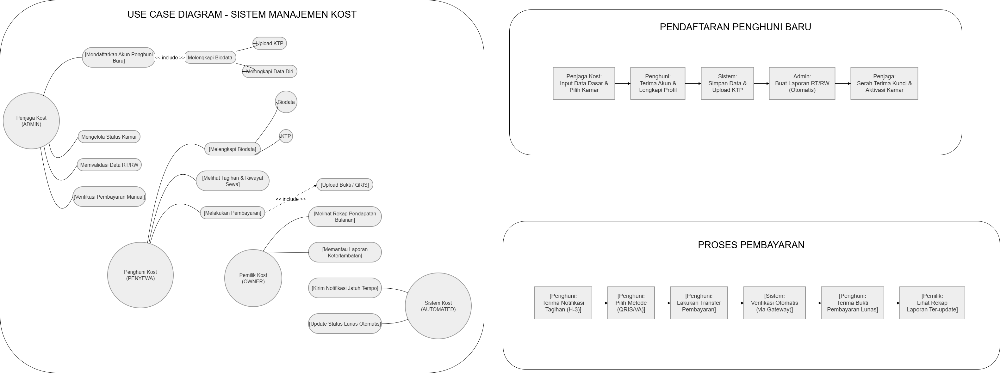

# 📦 Laporan Analisis Perancangan Berorientasi Objek - Kelompok 1

## 👥 Anggota Kelompok
| **Nama** | **NPM** |
| :--- | :--- |
| Chandra Cornelius L Tobing | 4524210022 |
| Andika Prasetyo | 4524210013 |
| Damar Syeka | 4524210023 |

 

# 📌 Informasi & Ruang Lingkup Proyek

## 🎯 Topik & Judul Proyek
* **Topik:** Bisnis – Manajemen Kost
* **Judul Project:** **Sistem Manajemen Kost** Aplikasi Pengelolaan Kost Berbasis Web dengan Notifikasi

## 🎯 Sasaran Pengguna (Aktor)
Sistem Manajemen Kost ini dirancang untuk memfasilitasi koordinasi antara pengelola dan penyewa, dengan rincian peran sebagai berikut:

* **Penjaga/Admin Kost:** Bertugas melakukan input data penghuni baru, memantau ketersediaan kamar, mengecek status pembayaran, dan mengelola kebersihan serta fasilitas kost.
* **Penghuni (Penyewa):** Mahasiswa atau pekerja yang menyewa kamar. Membutuhkan akses untuk mengunggah biodata, melihat tagihan bulanan, melakukan pembayaran langsung lewat sistem, dan menerima pengingat (reminder) pembayaran.
* **Pemilik Kost (Owner):** Pihak yang memantau rekapitulasi pendapatan bulanan, laporan keterlambatan, dan status kamar secara keseluruhan tanpa harus turun tangan langsung mengurus teknis harian.

---

## 💬 Hasil Wawancara Pengelolaan Kost Saat Ini
Berdasarkan observasi dan wawancara dengan pengelola kost, berikut adalah rangkuman prosedur operasional yang sedang berjalan:

<b>Bagian 1: Pengelolaan Data Penghuni & Tugas Harian</b>

 

**Q: Siapa saja yang terlibat dan apa kegiatan utamanya setiap hari?**
> Pengelolaan melibatkan pemilik kost dan penjaga kost (admin). Kegiatan sehari-hari meliputi pendataan penghuni baru, pengecekan kamar, dan memastikan kebersihan setiap lorong kost.

**Q: Bagaimana cara mencatat data penghuni kost saat ini?**
> Beberapa pencatatan sudah menggunakan aplikasi pihak ketiga (seperti Mamikos) untuk pemasaran. Namun, ada masalah pada pendataan manual, khususnya untuk keperluan lapor ke RT/RW setempat. Admin sering kali lupa atau datanya tercecer karena masih dicatat secara manual.

<b>Bagian 2: Sistem Pembayaran & Kendala</b>

 

**Q: Bagaimana sistem pembayaran kost saat ini?**
> Pembayaran biasanya dilakukan melalui transfer bank, namun masih ada juga anak kost yang membayar menggunakan uang tunai (cash).

**Q: Apakah sering terjadi keterlambatan pembayaran?**
> Sering. Mengingat rata-rata penghuni adalah mahasiswa, pembayaran sering kali terlambat karena harus menunggu kiriman uang bulanan dari orang tua mereka.

**Q: Apa kendala terbesar dalam mengelola kosan ini?**
> Kendala terbesar ada pada pemasaran (marketing) dan lokasi kost yang berada di dalam gang, sehingga menyulitkan akses masuk kendaraan (seperti mobil) dan mengurangi visibilitas.

<b>Bagian 3: Harapan Pengembangan Sistem</b>

 

**Q: Jika ada sistem manajemen digital, fitur apa yang paling dibutuhkan?**
> Harapan terbesarnya adalah efisiensi alur pembayaran. Penghuni tidak perlu lagi repot-repot menghubungi admin kost untuk konfirmasi transfer. Sistem diharapkan bisa memproses pembayaran (misal via QRIS atau virtual account), dan notifikasi pembayaran langsung diteruskan ke sistem serta diinformasikan kepada pemilik kost (ibu kost). Selain itu, sistem diharapkan bisa menyimpan biodata penghuni dan detail harga kost secara otomatis.

 

# 🚨 Latar Belakang & Masalah
Pengelolaan operasional kost saat ini masih memiliki celah administratif yang menghambat efisiensi, antara lain:

1. **Konfirmasi Pembayaran Manual:** Pembayaran via transfer masih memerlukan konfirmasi manual via chat WhatsApp kepada penjaga/pemilik, yang berisiko tertumpuk atau terlewat.
2. **Keterlambatan Pembayaran Tanpa Pengingat:** Banyak penghuni mahasiswa yang sering terlambat membayar. Saat ini belum ada sistem notifikasi otomatis untuk mengingatkan jadwal jatuh tempo.
3. **Data Administrasi Tercecer:** Proses input data biodata penyewa untuk pelaporan lingkungan (RT/RW) masih manual sehingga rawan hilang dan sering dilupakan oleh penjaga.
4. **Monitoring Ketersediaan Kamar:** Sulit memantau status ketersediaan kamar secara *real-time* jika hanya mengandalkan ingatan atau catatan kertas.

---

# 💡 Solusi & Perbandingan SOP

Sistem ini akan mengubah alur kerja manual menjadi serba digital dengan pendekatan *self-service* bagi penghuni dan *dashboard monitoring* bagi pengelola.

## ⚖️ Analisis Perbandingan SOP (Manual vs Sistem)

<b>1. Pendataan Penghuni Baru</b>
 

* **❌ SOP Manual:** Penjaga meminta KTP secara langsung/via chat, lalu mencatat manual di buku untuk dilaporkan ke RT/RW. Sering lupa dicatat.
* **✅ SOP Sistem:** Penghuni baru diwajibkan *upload* biodata dan foto KTP secara mandiri melalui *E-Form* pada sistem sebelum serah terima kunci. Data otomatis tersimpan di *database*.

<b>2. Proses Pembayaran Bulanan</b>
 

* **❌ SOP Manual:** Penghuni transfer uang > *Screenshot* bukti transfer > Kirim via WA ke Admin > Admin mencatat di buku > Lapor ke Pemilik.
* **✅ SOP Sistem:** Penghuni login > Lihat tagihan > Bayar (upload bukti atau via Payment Gateway/QRIS) > Sistem otomatis mengubah status menjadi "Lunas" > Pemilik dan Admin bisa langsung melihat *update* secara *real-time*.

<b>3. Penanganan Jatuh Tempo</b>
 

* **❌ SOP Manual:** Admin harus mengingat atau mengecek buku satu per satu, lalu menagih secara manual dari kamar ke kamar atau via chat (terkadang sungkan).
* **✅ SOP Sistem:** Sistem memiliki fitur *Automated Reminder*. H-3 dan Hari-H jatuh tempo, sistem akan mengirimkan notifikasi tagihan langsung ke dasbor penghuni (atau integrasi email/WA).

---

# ⚙️ Use Case Sistem

## **👥 Ringkasan Aktor & Tujuan**

| Aktor | Tujuan | Skenario Tindakan Utama |
| :--- | :--- | :--- |
| **Admin** | **Manajemen Kamar** | Mengubah status kamar (Kosong / Terisi / Sedang Diperbaiki). |
| | **Validasi Data** | Mengecek keabsahan biodata penghuni untuk laporan RT/RW. |
| | **Cek Pembayaran** | Memverifikasi pembayaran manual (jika ada) dan cetak laporan. |
| **Penghuni** | **Akses Informasi** | Melihat sisa waktu sewa, tagihan bulan ini, dan riwayat pembayaran. |
| | **Pembayaran Digital** | Melakukan proses pembayaran tagihan secara mandiri melalui sistem. |
| **Pemilik Kost**| **Monitoring Bisnis** | Melihat rekapitulasi total pendapatan bulanan dan daftar penghuni yang menunggak pembayaran. |

## **Detail Use Case**

### A. Registrasi & Pendataan Penghuni Baru
**Aktor:** Penghuni & Admin
1. Admin mendaftarkan akun untuk kamar yang disewa.
2. Penghuni login pertama kali dan diwajibkan melengkapi form biodata diri (KTP, Kontak Darurat, Pekerjaan/Kampus).
3. Sistem menyimpan data secara terpusat.
4. Admin dapat mengunduh rekap data tersebut sewaktu-waktu jika RT/RW meminta laporan penduduk sementara.

### B. Proses Tracking Pembayaran & Konfirmasi Otomatis
**Aktor:** Penghuni & Pemilik Kost
1. Sistem menerbitkan tagihan bulanan pada dasbor penghuni H-7 sebelum jatuh tempo.
2. Penghuni memilih metode pembayaran dan memproses transaksi (Upload Bukti / QRIS).
3. Sistem memvalidasi pembayaran dan mengubah status tagihan menjadi **"Lunas"**.
4. Sistem tidak lagi mengharuskan penghuni mengirim pesan ke Admin. Data langsung *update* di dashboard Admin dan Pemilik Kost.

### C. Sistem Notifikasi (Reminder) Keterlambatan
**Aktor:** Sistem
1. Sistem mengecek *database* setiap hari secara otomatis.
2. Jika tanggal saat ini melewati batas jatuh tempo dan status masih "Belum Lunas", sistem otomatis memberikan penanda **Merah (Terlambat)**.
3. Sistem mengirimkan pengingat (notifikasi) peringatan keterlambatan pembayaran ke akun penghuni.

### **📊 Diagram Use Case**

---

## 🎯 Target Hasil Akhir
* **Bagi Pengelola:** Menghilangkan beban penagihan manual dan kesalahan pencatatan data.
* **Bagi Penghuni:** Memberikan pengalaman pembayaran yang mulus (*seamless*), terdata dengan rapi, dan transparan.
* **Bagi Pemilik:** Mendapatkan pelaporan keuangan bulanan yang akurat, otomatis, dan minim *human-error*.

---

## Link Video
